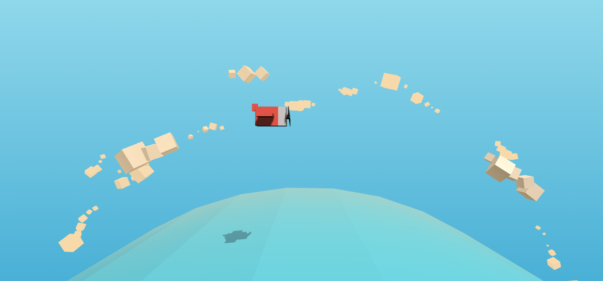
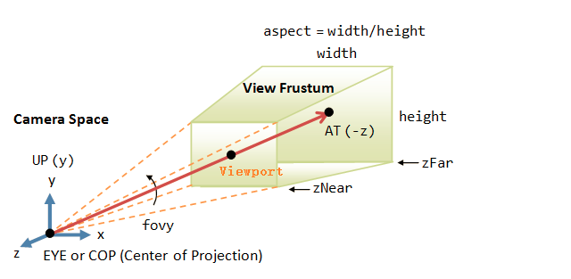
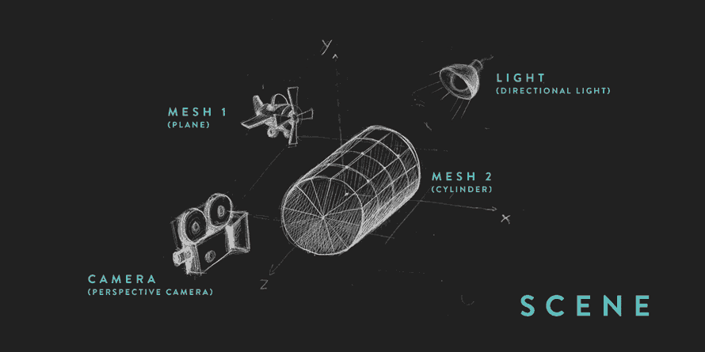
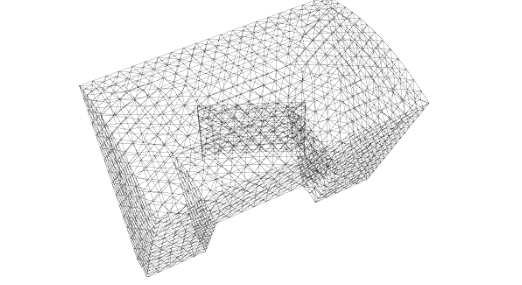
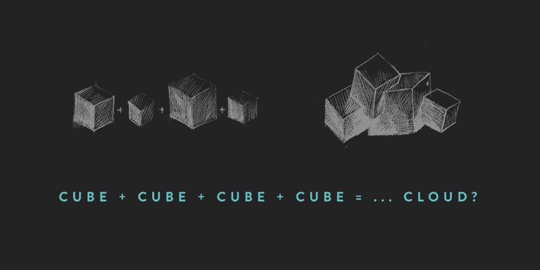
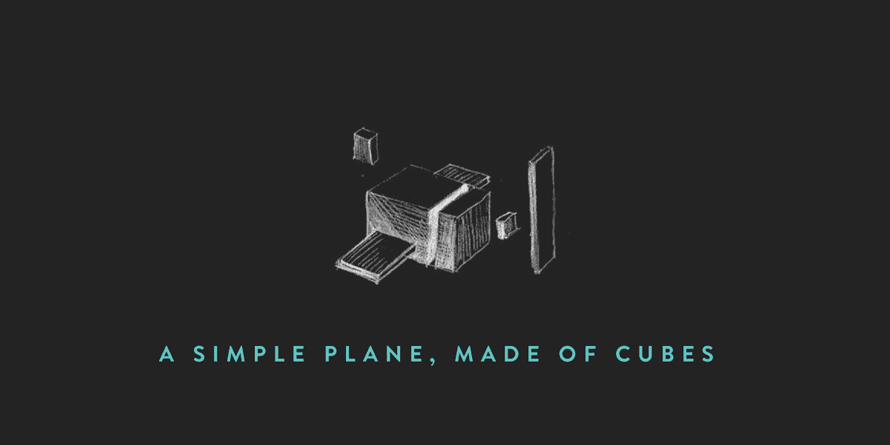

# three_demo_airplane

* 一个学习three的飞行3D场景

https://foolmadao.github.io/three_demo_airplane/



## threeJs的三大组件

在Three.js中，要渲染物体到网页中，我们需要3个组件： 

### 1.场景（scene）
```
var scene = new THREE.Scene();
```

场景是所有物体的容器，需要把所有显示的对象对象加入场景中。

### 2.相机（camera）
相机决定了场景中那个角度的景色会显示出来。相机就像人的眼睛一样，人站在不同位置，抬头或者低头都能够看到不同的景色,three中有很多种相机类型，这里介绍用到的远景相机（PerspectiveCamera）。
```
camera = new THREE.PerspectiveCamera(
  fieldOfView,  // 视角的角度
  aspectRatio,  // 宽高比
  nearPlane,   // 近点距离
  farPlane    // 远点距离
);
```


### 3.渲染器（renderer）

渲染器决定了渲染的结果应该画在页面的什么元素上面，并且以怎样的方式来绘制。这里我们定义了一个WebRenderer渲染器
```
  // Create the renderer
  renderer = new THREE.WebGLRenderer({ 

    alpha: true,  // 画布包含透明缓冲

    antialias: true // 抗锯齿 
  });

  // 设置画布尺寸
  renderer.setSize(WIDTH, HEIGHT);

  container = document.getElementById('world');
  container.appendChild(renderer.domElement);
```
## 场景概览



### 如何在场景中添加几何体
在Three中，集合体由几何模型和材料两部分组成

* 几何模型是由空间中大量的三角形几何面片组成，而Three中封装了大量的常用的几何体 

* 材料是构成填充几何模型的材质

* 几何体和材料共同就可以构成一个网格模型mesh

```
  // 创建一个圆柱体作为海
  // radius top, radius bottom, height, number of segments on the radius, number of segments vertically
  var geom = new THREE.CylinderGeometry(600,600,800,40,10);
   
  // 放平
  geom.applyMatrix(new THREE.Matrix4().makeRotationX(-Math.PI/2));
   
  // create the material
  var mat = new THREE.MeshPhongMaterial({
    color:Colors.blue,
    transparent:true,
    opacity:.6,
    flatShading:THREE.FlatShading,
  });

  // 初始化mesh
  this.mesh = new THREE.Mesh(geom, mat);
```


## Cloud



## Plane




## 如何让画面动起来

创建帧动画
```
function loop(){
  // 更新场景位置
  airplane.propeller.rotation.x += 0.3;
  sea.mesh.rotation.z += .005;
  sky.mesh.rotation.z += .01;
  camera.position

  // 更新飞机跟随鼠标位置，和螺旋桨的旋转
  updatePlane();

  renderer.render(scene, camera);

  // 动画循环
  requestAnimationFrame(loop);
}
```

##  参考

http://www.jq22.com/jquery-info17198

https://techbrood.com/threejs/docs/

## 学习Three的推荐

* 文档的中文翻译 https://techbrood.com/threejs/docs/
* 英文文档 https://threejs.org/docs/index.html#manual/en/introduction/Creating-a-scene
* 大量的three案例的博客 https://www.wjceo.com/blog/threejs/
* 《three.js入门》及其书例代码 http://zhangwenli.com/ThreeExample.js/
